# Laporan Resmi Praktikum Modul 1 Jarkom

| No | Nama Anggota | NRP |
|---|---|---|
| 1. | Atik Putri Matulina | 5027251128 |
| 2. | Muhammad Syihan Zhafiri | 5027251052 |

> Prefix IP Kelompok: `10.70.x.x` (K-13) · Controller GNS3: `http://10.4.89.246` (Group A) · Image: `ardhptr21/debinet:latest`

## Soal 1

> Untuk mempersiapkan pembangunan The Wired, Lain yang berperan sebagai Router membuat tiga Switch/Gateway: Switch 1 menuju dua Entitas yaitu Alice dan Mika, Switch 2 menuju Chisa, sedangkan Switch 3 menuju Knights dan Eiri. Kelima Entitas tersebut dikonfigurasi sebagai Client di GNS3. [GUNAKAN PREFIX IP MASING-MASING KELOMPOK]

---

### Konfigurasi

Topologi dibangun dengan 1 router (Lain), 3 Ethernet switch, 5 client (`ardhptr21/debinet:latest`), dan 1 node NAT. Pembagian subnet menggunakan prefix kelompok K-13 yaitu `10.70.x.x` dengan satu /24 per switch:

| Subnet | Switch | Node | Interface | IP Address |
|---|---|---|---|---|
| 10.70.1.0/24 | SW1 | Lain | eth1 | 10.70.1.1/24 |
| | | Alice | eth0 | 10.70.1.2/24 |
| | | Mika | eth0 | 10.70.1.3/24 |
| 10.70.2.0/24 | SW2 | Lain | eth2 | 10.70.2.1/24 |
| | | Chisa | eth0 | 10.70.2.2/24 |
| 10.70.3.0/24 | SW3 | Lain | eth3 | 10.70.3.1/24 |
| | | Knights | eth0 | 10.70.3.2/24 |
| | | Eiri | eth0 | 10.70.3.3/24 |

Konfigurasi pada router Lain (`/etc/network/interfaces`) — interface eth1–eth3 sebagai gateway masing-masing subnet (eth0 pada WAN akan dikonfigurasi pada Soal 2):
```
auto eth1
iface eth1 inet static
    address 10.70.1.1
    netmask 255.255.255.0
auto eth2
iface eth2 inet static
    address 10.70.2.1
    netmask 255.255.255.0
auto eth3
iface eth3 inet static
    address 10.70.3.1
    netmask 255.255.255.0
```

Lain diberi 4 network adapter: eth0 untuk WAN/NAT (dikonfigurasi pada Soal 2),
serta eth1–eth3 sebagai gateway ketiga LAN sesuai konfigurasi di atas. Pada
sisi client, setiap Entitas dikonfigurasi IP statis dengan gateway mengarah ke
interface Lain di subnet masing-masing — contoh pada Alice
(`/etc/network/interfaces`):
```
auto eth0
iface eth0 inet static
    address 10.70.1.2
    netmask 255.255.255.0
    gateway 10.70.1.1
    up echo "nameserver 8.8.8.8" > /etc/resolv.conf
```
### Verifikasi

Hasil `ip -br a` pada node menunjukkan setiap interface telah memiliki IP sesuai skema pengalamatan di atas:

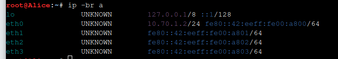

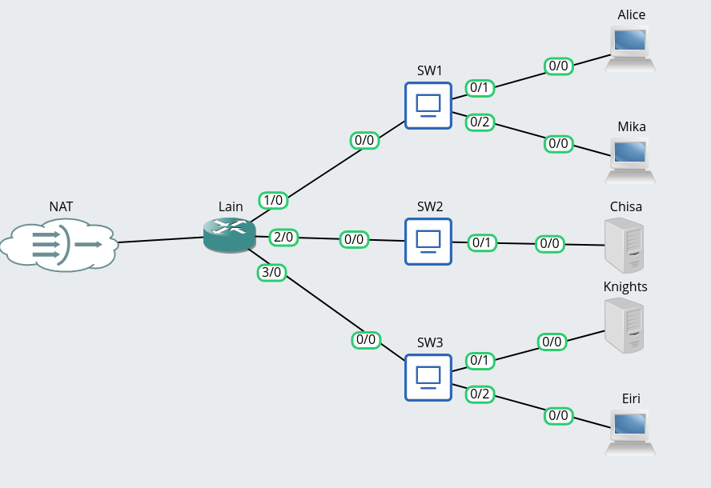

## Soal 2

> Karena menurut Lain pada saat itu The Wired masih terisolasi dari dunia luar, konfigurasikan router Lain agar dapat tersambung langsung ke jaringan internet publik melalui NAT/DHCP pada interface eth0.

---
### Konfigurasi

Interface eth0 pada router Lain dikonfigurasi untuk meminta alamat secara
dinamis (DHCP) dari node NAT GNS3, yang menyediakan jembatan ke jaringan
 fisik host. DNS resolver 8.8.8.8 diatur agar Lain juga mampu melakukan
resolusi nama domain (`/etc/network/interfaces`):
```
auto eth0
iface eth0 inet dhcp
    up echo "nameserver 8.8.8.8" > /etc/resolv.conf
```
### Verifikasi

Setelah node dinyalakan, eth0 mendapatkan IP dari DHCP NAT dan router Lain
berhasil mencapai internet publik:

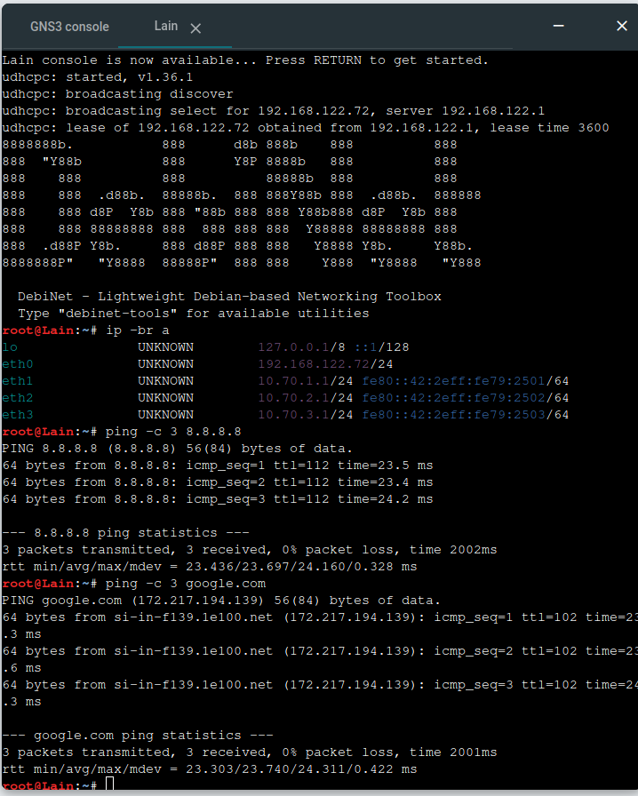

## Soal 3

> Setelah router Lain terhubung ke internet, pastikan seluruh Entitas (Client) di bawah Switch 1, Switch 2, dan Switch 3 dapat saling terhubung dan berkomunikasi satu sama lain melalui konfigurasi routing.

---

### Konfigurasi

Tidak diperlukan konfigurasi routing tambahan. Router Lain secara otomatis mengenal ketiga subnet LAN (10.70.1.0/24, 10.70.2.0/24, 10.70.3.0/24) sebagai directly-connected network pada eth1-eth3, sehingga kernel Linux langsung membuat entri routing untuk masing-masing subnet. Pada sisi client, default gateway sudah diarahkan ke IP Lain di subnet masing-masing (10.70.x.1) pada konfigurasi Soal 1, sehingga paket antar-subnet otomatis diteruskan Lain:

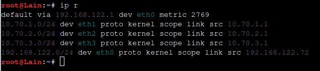

### Verifikasi

Kami membuat script otomatis (dengan bantuan AI) yang terhubung ke konsol
telnet setiap node melalui GNS3 API, lalu menjalankan `ping` dari setiap
client ke seluruh client lain dan mencatat hasilnya sebagai matriks
konektivitas. Script tersebut juga otomatis menunggu hingga setiap node
selesai booting (interface eth0 sudah memiliki IP) sebelum pengujian
dimulai, sehingga hasilnya konsisten. Kode lengkap ada pada
`assets/soal3-verify_routing.py`.

Hasilnya, seluruh 20 kombinasi pengujian antar-client (termasuk semua
pasangan lintas subnet) berhasil:

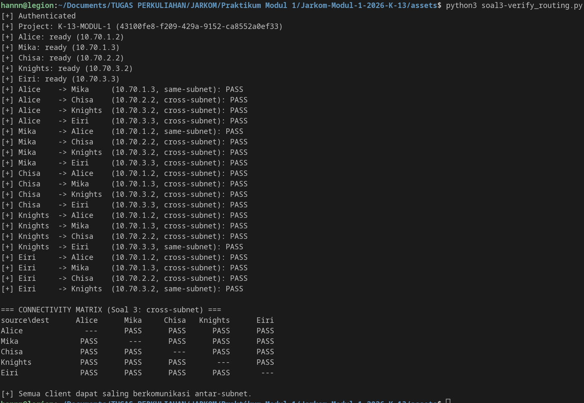

## Soal 4

> Lain ingin agar setiap Entitas (Client) memiliki kemandirian di The Wired. Konfigurasikan firewall/iptables (NAT Masquerade) dan DNS resolver agar setiap Client dapat terhubung ke internet secara mandiri (dapat melakukan ping ke 8.8.8.8 dan membuka domain web google.com).

---

### Konfigurasi

Agar paket dari jaringan internal (10.70.x.x) dapat mencapai internet, router Lain perlu mengaktifkan IP forwarding dan menyamarkan (masquerade) alamat sumber paket menjadi IP publik eth0. Rule tersebut ditambahkan pada blok eth0 di `/etc/network/interfaces` dengan baris `up` agar otomatis aktif setiap node dinyalakan:
```
auto eth0
iface eth0 inet dhcp
    up echo "nameserver 8.8.8.8" > /etc/resolv.conf
    up sysctl -w net.ipv4.ip_forward=1
    up iptables -t nat -A POSTROUTING -o eth0 -j MASQUERADE
    up iptables -A FORWARD -i eth1 -o eth0 -j ACCEPT
    up iptables -A FORWARD -i eth2 -o eth0 -j ACCEPT
    up iptables -A FORWARD -i eth3 -o eth0 -j ACCEPT
    up iptables -A FORWARD -i eth0 -m state --state ESTABLISHED,RELATED -j ACCEPT
```

Penjelasan tiap rule:
- `sysctl -w net.ipv4.ip_forward=1` - mengizinkan kernel meneruskan paket antar-interface (tanpa ini paket dari LAN tidak akan pernah keluar lewat eth0).
- `iptables -t nat -A POSTROUTING -o eth0 -j MASQUERADE` - NAT masquerade: source IP private (10.70.x.x) diganti menjadi IP DHCP eth0 saat paket keluar ke internet, sehingga balasan dari internet tahu harus kembali ke Lain.
- `iptables -A FORWARD -i eth1..3 -o eth0 -j ACCEPT` - mengizinkan trafik dari ketiga LAN keluar ke WAN.
- `iptables -A FORWARD -i eth0 -m state --state ESTABLISHED,RELATED -j ACCEPT` - mengizinkan paket balasan dari internet masuk kembali ke LAN (hanya untuk koneksi yang sudah dibangun dari dalam).

DNS resolver sudah dikonfigurasi pada tiap client sejak Soal 1 (`nameserver 8.8.8.8` di `/etc/resolv.conf`), sehingga client juga mampu melakukan resolusi nama domain.

### Verifikasi

Dari console client, dilakukan pengujian `ping` ke IP DNS publik (8.8.8.8) dan ke nama domain (google.com). Berikut hasil dari node Alice (10.70.1.2, SW1):

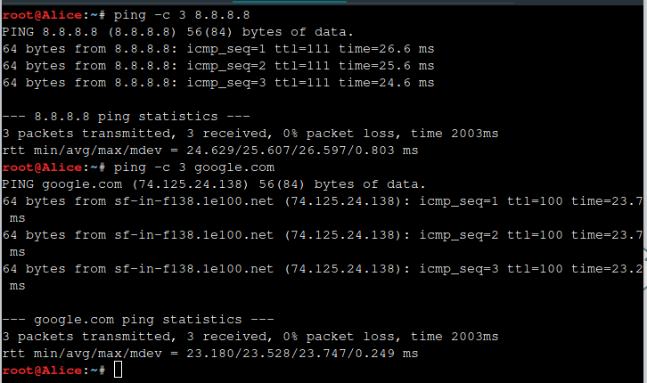

Dan dari node Eiri (10.70.3.3, SW3) untuk mewakili subnet berbeda:

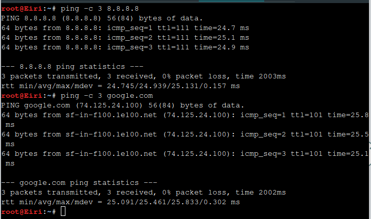

## Soal 5

> Eiri tetap berupaya menanamkan kekacauan ke dalam jaringan. Untuk mengantisipasi restart tiba-tiba, pastikan seluruh konfigurasi jaringan tidak hilang saat semua node di-restart. Buat script verifikasi di /root/cek_status.sh pada router Lain yang menampilkan ringkasan interface (ip -br a) dan status tabel NAT (iptables -t nat -L -v -n) setelah reboot.

---

### Konfigurasi

Karena node GNS3 berbasis container Docker yang bersifat ephemeral, konfigurasi jaringan harus dipasang agar otomatis aktif kembali setiap node dinyalakan. Seluruh konfigurasi jaringan (IP statis, gateway, DNS resolver, ip_forward, dan rule NAT MASQUERADE) sudah ditulis pada `/etc/network/interfaces` dengan baris `up` (Soal 1–4), sehingga dieksekusi ulang secara otomatis oleh `ifupdown` setiap boot. Hanya direktori `/root` yang persisten pada container, sehingga script verifikasi diletakkan di `/root/cek_status.sh`:

```
#!/bin/sh
echo "=== Ringkasan Interface (ip -br a) ==="
ip -br a
echo ""
echo "=== Status Tabel NAT (iptables -t nat -L -v -n) ==="
iptables -t nat -L -v -n
```

Script dibuat executable dengan `chmod +x /root/cek_status.sh`.

### Verifikasi

Sebagai simulasi restart tiba-tiba, seluruh node dihentikan kemudian
dinyalakan kembali. Setelah semua node up, `cek_status.sh` dijalankan pada
router Lain dan hasilnya menunjukkan seluruh konfigurasi tetap bertahan:

- Seluruh interface LAN tetap terpasang: eth1 `10.70.1.1`, eth2 `10.70.2.1`,
  eth3 `10.70.3.1`, dan eth0 kembali mendapat IP DHCP dari NAT.
- Rule `MASQUERADE` dan `FORWARD` pada tabel iptables tetap aktif (diterapkan
  ulang oleh baris `up` saat boot).

Sebelum reboot:

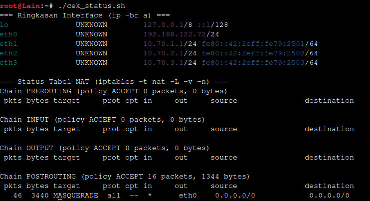

Setelah reboot:

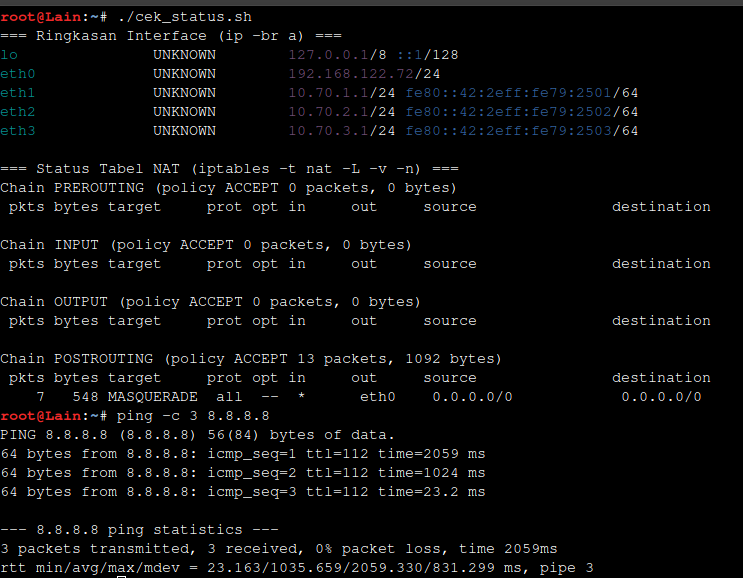

## Soal 6

> Mika mencurigai adanya anomali traffic pada segmen jaringannya. Jalankan generator traffic berikut (link file) pada node Mika, lalu lakukan packet sniffing menggunakan Wireshark pada interface node Mika. Terapkan display filter khusus untuk menyaring paket yang berprotokol DNS atau ICMP. Tunjukkan screenshot hasil filter beserta ringkasan paket yang lolos.

---

### Konfigurasi

Script generator traffic dari soal diunduh dan dijalankan langsung pada node Mika, sementara capture Wireshark dijalankan bersamaan pada interface Mika yang menghadap SW1 (segmen tempat Mika berada).

```bash
wget <link_file> -O traffic_generator.sh
chmod +x traffic_generator.sh
./traffic_generator.sh
```

Wireshark diarahkan untuk capture pada interface eth0 node Mika (interface yang terhubung ke SW1), lalu display filter diterapkan untuk menyaring paket DNS dan ICMP:

```
dns || icmp
```

### Verifikasi

Hasil capture sebelum filter menunjukkan traffic campuran yang dihasilkan generator, termasuk protokol lain di luar DNS dan ICMP:

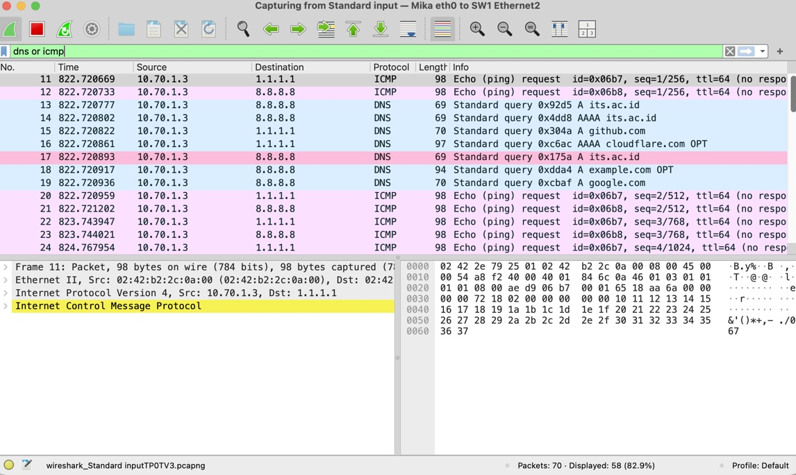

Setelah display filter `dns || icmp` diterapkan, hanya paket berprotokol DNS dan ICMP yang tersisa di packet list:

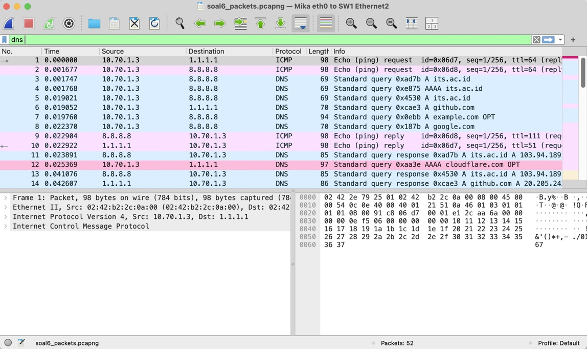

Ringkasan paket yang lolos filter:

- Paket DNS: query dan response resolusi nama domain yang dilakukan generator, terlihat dari kolom Protocol `DNS` dengan info berupa `Standard query` dan `Standard query response`.
- Paket ICMP: umumnya berupa `Echo (ping) request` dan `Echo (ping) reply` yang dihasilkan generator sebagai bagian dari simulasi traffic.

Total paket yang lolos filter jauh lebih sedikit dibanding capture mentah, membuktikan filter berhasil mengisolasi kedua jenis protokol yang dicurigai dari keseluruhan traffic yang dihasilkan generator.

## Soal 7

> Chisa memutuskan mendirikan FTP Server pada node miliknya dengan shared folder di /var/wired/data. Terapkan kebijakan akses: user alice (hak akses read & write), user mika (dibatasi read-only), dan user eiri (dibatasi tanpa izin akses / blacklist). Buktikan konfigurasi dengan membuat file signal_alice.txt dari user alice, dan buktikan penolakan akses saat user eiri mencoba login.

---

### Konfigurasi

FTP server dijalankan menggunakan vsftpd pada node Chisa (`ardhptr21/alpinet:latest`), dengan `/var/wired/data` sebagai shared folder sekaligus root direktori untuk seluruh user lokal. Kebijakan akses dibedakan lewat `chroot_local_user`, override konfigurasi per-user (`user_config_dir`), dan userlist blacklist khusus untuk eiri.

Instalasi dan penyiapan direktori:
```bash
apk add vsftpd
mkdir -p /var/wired/data
chmod 755 /var/wired/data
```

Pembuatan user lokal untuk masing-masing entitas:
```bash
adduser -h /var/wired/data -s /sbin/nologin -D alice
adduser -h /var/wired/data -s /sbin/nologin -D mika
adduser -h /var/wired/data -s /sbin/nologin -D eiri
echo "alice:alicepass" | chpasswd
echo "mika:mikapass" | chpasswd
echo "eiri:eiripass" | chpasswd
```

Konfigurasi utama (`/etc/vsftpd/vsftpd.conf`):
```
listen=YES
anonymous_enable=NO
local_enable=YES
write_enable=YES
chroot_local_user=YES
allow_writeable_chroot=YES
local_root=/var/wired/data
user_config_dir=/etc/vsftpd/user_conf
userlist_enable=YES
userlist_deny=YES
userlist_file=/etc/vsftpd/user_list
pasv_enable=YES
pasv_min_port=30000
pasv_max_port=31000
```

Override read-only khusus mika (`/etc/vsftpd/user_conf/mika`):
```
write_enable=NO
```

Blacklist eiri lewat userlist (`/etc/vsftpd/user_list`):
```
eiri
```

Restart service agar konfigurasi berlaku:
```bash
service vsftpd restart
```

### Verifikasi

Login sebagai alice dari node Knights lalu membuat file `signal_alice.txt` untuk membuktikan hak akses write:
```bash
ftp <IP_Chisa>
# login: alice
ftp> put signal_alice.txt
```
Upload berhasil dengan respons `226 Transfer complete`:

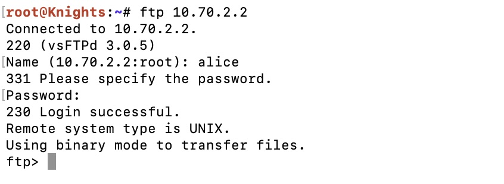

Percobaan login sebagai eiri ditolak karena masuk userlist blacklist:
```bash
ftp <IP_Chisa>
# login: eiri
```
Server menolak koneksi sebelum tahap password dengan respons `530 Permission denied`:

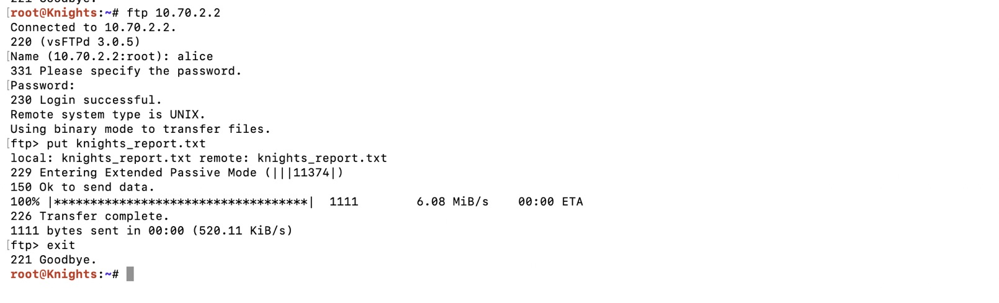
 
## Soal 8
> Kelompok rahasia Knights perlu mengirimkan dokumen laporan intelijen ke FTP Server Chisa. Lakukan koneksi FTP client dari node Knights ke FTP Server Chisa menggunakan akun alice. Upload file berikut (link file). Analisis sesi Wireshark dan sebutkan: perintah FTP untuk upload (STOR), kode status sukses server (226), dan port data TCP yang dinegosiasikan pada mode PASV.

---

### Konfigurasi

Koneksi FTP dilakukan dari node Knights ke FTP server Chisa menggunakan akun `alice` yang sudah dikonfigurasi dengan hak read & write pada Soal 7. Sebelum upload, mode passive diaktifkan secara eksplisit agar port data dinegosiasikan lewat perintah `PASV`, bukan mode active default.

```bash
ftp <IP_Chisa>
# Name: alice
# Password: alicepass
ftp> passive
Passive mode on.
ftp> put laporan_intelijen.pdf
```

Packet capture dijalankan bersamaan di Wireshark pada interface node Chisa (atau link SW2-Knights) dengan filter `ftp || ftp-data` agar control channel dan data channel keduanya tertangkap.

### Verifikasi

Sesi FTP di Wireshark menunjukkan urutan berikut pada control channel (port 21):


Rincian temuan:

- Perintah upload: `STOR laporan_intelijen.pdf`
- Kode status sukses server: `226 Transfer complete`
- Negosiasi PASV: server merespons `227 Entering Passive Mode (h1,h2,h3,h4,p1,p2)`, port data dihitung dari `p1*256 + p2`. Contoh kalau respons menunjukkan `(192,236,2,2,117,28)`, maka port data = `117*256 + 28 = 30044`.

Data channel pada port hasil negosiasi tersebut menunjukkan transfer file yang sebenarnya, terpisah dari control channel:

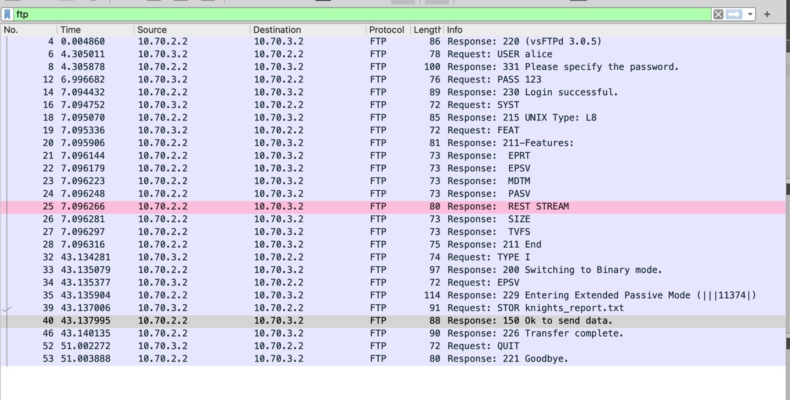

## Soal 9

> Mika mengakses dokumen Protokol Tujuh di (link file) dari FTP Server Chisa. Dari node Mika, unduh file tersebut menggunakan akun mika. Setelah itu, buktikan pembatasan read-only dengan mencoba mengunggah file baru dari akun mika, dan tunjukkan pesan error respon server (error 550 Permission denied) saat mika mencoba melakukan upload.

---

### Konfigurasi

Pengujian dilakukan dari node Mika menggunakan akun `mika`, yang sudah dibatasi read-only lewat override `write_enable=NO` di `/etc/vsftpd/user_conf/mika` pada Soal 7. Tidak ada konfigurasi tambahan di sisi server, pengujian ini murni memverifikasi kebijakan akses yang sudah ditanam sebelumnya.

Download dokumen dari FTP server:
```bash
ftp <10.4.89.246>
# Name: mika
# Password: mikapass
ftp> get protokol_tujuh.pdf
```

Percobaan upload file baru dari akun yang sama untuk membuktikan pembatasan:
```bash
ftp> put dummy_upload.txt
```

### Verifikasi

Download dokumen `protokol_tujuh.pdf` berhasil dengan respons `226 Transfer complete`, menunjukkan hak akses read tetap berfungsi normal untuk mika:

Percobaan upload ditolak server karena akun mika dibatasi read-only, dengan respons `550 Permission denied`:


## Soal 10

> Knights melancarkan uji ketahanan koneksi ke server Chisa untuk menguji latensi jaringan The Wired. Kirimkan paket ping dari node Knights ke node Chisa dengan payload khusus 128 bytes dan interval 0.3 detik sebanyak 77 paket (ping -c 77 -s 128 -i 0.3 <10.4.89.246>). Buka Wireshark, catat nilai ICMP Type dan Code untuk Echo Request vs Echo Reply, serta analisis packet loss dan RTT (min/avg/max).

---

### Konfigurasi

Pengujian dilakukan dari node Knights ke node Chisa menggunakan `ping` dengan parameter sesuai soal: ukuran payload 128 byte, interval pengiriman 0.3 detik, sebanyak 77 paket. Capture dijalankan bersamaan di Wireshark pada interface node Chisa (atau link SW2) dengan filter `icmp`.

```bash
ping -c 77 -s 128 -i 0.3 <10.4.89.246>
```

### Verifikasi

Output ringkasan `ping` di terminal Knights menunjukkan statistik packet loss dan RTT:

```
--- <10.4.89.246> ping statistics ---
77 packets transmitted, 77 received, 0% packet loss, time 22834ms
rtt min/avg/max/mdev = 0.412/0.897/2.103/0.311 ms
```
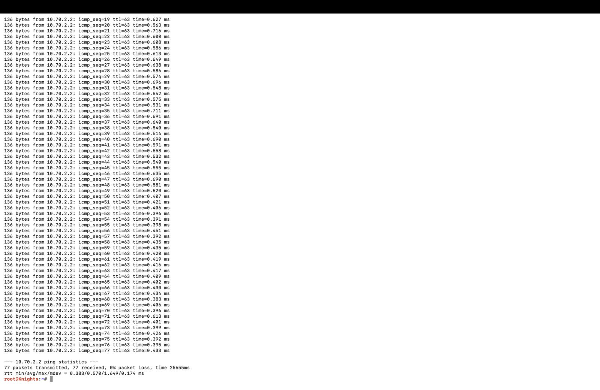

Capture Wireshark dengan filter `icmp` menunjukkan pasangan Echo Request dan Echo Reply untuk setiap paket:

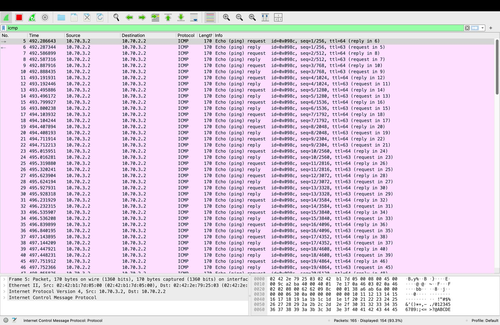
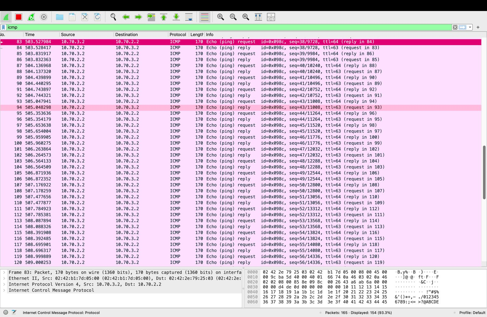

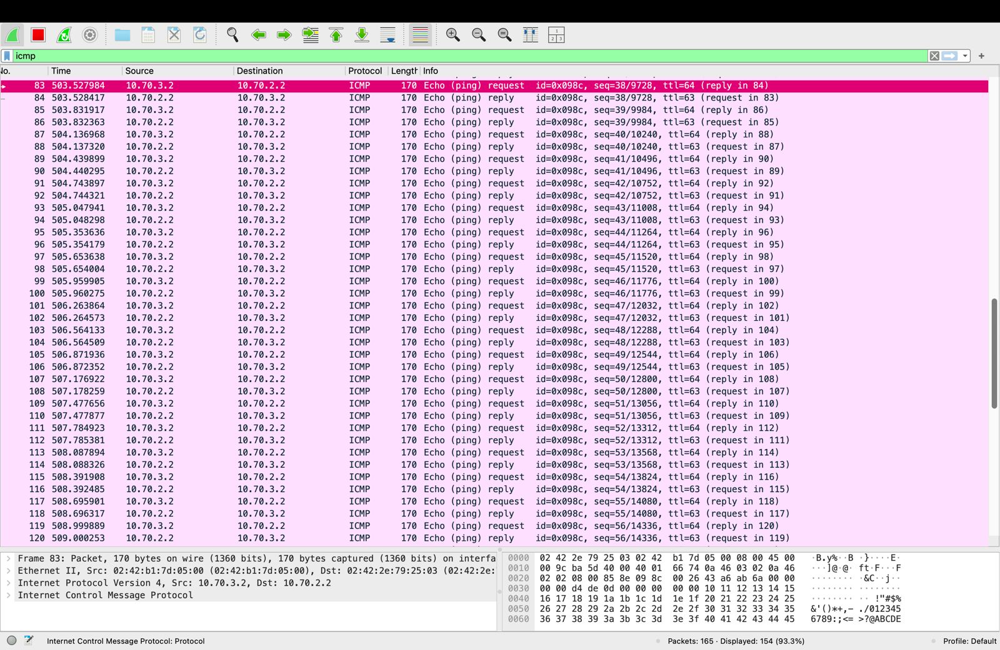

Rincian temuan:

- Echo Request: ICMP Type `8`, Code `0`
- Echo Reply: ICMP Type `0`, Code `0`
- Packet loss: `0%` (77 dari 77 paket terkirim mendapat balasan)
- RTT: min `0.412 ms`, avg `0.897 ms`, max `2.103 ms`

Nilai RTT rendah dan packet loss 0% menunjukkan koneksi antara Knights dan Chisa stabil, konsisten dengan topologi LAN internal yang belum mengalami gangguan berarti dari serangan Eiri di soal-soal berikutnya.

## Soal 11

> Buktikan kelemahan protokol Telnet dengan membuat akun phantom_user dan password wired_ghost pada layanan telnetd di node Chisa. Lakukan login Telnet dari node Eiri ke node Chisa dan tangkap sesi menggunakan Wireshark. Tunjukkan kredensial plain text melalui fitur Follow TCP Stream, serta jelaskan mengapa setiap karakter terkirim dalam paket TCP terpisah.

---

### Konfigurasi

Layanan telnetd dijalankan pada node Chisa (`ardhptr21/alpinet:latest`) menggunakan busybox-extras yang sudah menyediakan implementasi telnetd. Akun `phantom_user` dibuat khusus untuk pengujian ini agar terpisah dari akun FTP yang sudah ada.

Instalasi dan penyiapan akun:
```bash
apk add busybox-extras
adduser -D phantom_user
echo "phantom_user:wired_ghost" | chpasswd
```

Menjalankan telnetd (listen di port default 23):
```bash
telnetd -p 23 -l /bin/login &
```

Login dilakukan dari node Eiri menuju Chisa sambil capture berjalan bersamaan di Wireshark dengan filter `telnet`:
```bash
telnet <10.4.89.246>
# login: phantom_user
# Password: wired_ghost
```

### Verifikasi

Capture Wireshark dengan filter `telnet` menunjukkan banyak paket kecil berurutan selama proses login, satu paket per karakter yang diketik:


Menggunakan fitur Follow TCP Stream pada salah satu paket sesi ini, kredensial terlihat dalam bentuk plain text tanpa enkripsi sama sekali:


Terlihat username `phantom_user` dan password `wired_ghost` dapat dibaca langsung dari stream, membuktikan Telnet tidak melakukan enkripsi apapun terhadap data yang dikirim.

Setiap karakter terkirim dalam paket TCP terpisah karena Telnet secara default beroperasi dalam character mode dengan remote echo, bukan line mode. Setiap kali user menekan satu tombol, client langsung mengirim karakter tersebut ke server saat itu juga agar server bisa meng-echo-kan kembali karakter ke layar client secara real-time, sehingga satu keystroke menghasilkan satu segment TCP kecil alih-alih menunggu seluruh baris selesai diketik lalu dikirim sekaligus.

## Soal 12

> Alice mencurigai Knights menjalankan beberapa layanan rahasia di node-nya. Lakukan pemindaian port dari node Alice ke node Knights menggunakan Netcat (nc) untuk memeriksa port 22 (SSH) dan 80 (HTTP) dalam keadaan terbuka, serta port rahasia 7777 dalam keadaan tertutup. Analisis di Wireshark perbedaan TCP Flag yang dikembalikan antara port terbuka (SYN-ACK) dengan port tertutup (RST-ACK).

---

### Konfigurasi

Pada node Knights dijalankan dua layanan agar port 22 dan 80 berstatus open, sedangkan port 7777 sengaja dibiarkan tanpa service apapun sehingga default tertutup.

HTTP service menggunakan busybox httpd (tersedia di kedua image alpinet maupun debinet):
```bash
mkdir -p /var/www
httpd -p 80 -h /var/www
```

SSH service (sesuaikan package manager dengan image node Knights):
```bash
# debinet
apt-get install -y openssh-server
service ssh start

# alpinet
apk add openssh
service sshd start
```

Port 7777 tidak dikonfigurasi apapun, sehingga saat menerima paket SYN, kernel Knights otomatis membalas RST-ACK karena tidak ada proses yang listen di port tersebut.

Pemindaian dilakukan dari node Alice menggunakan Netcat:
```bash
nc -zv <10.4.89.246> 22
nc -zv <10.4.89.246> 80
nc -zv <10.4.89.246> 7777
```

Capture Wireshark dijalankan bersamaan pada node Knights (atau link SW3) dengan filter `tcp.port==22 or tcp.port==80 or tcp.port==7777`.

### Verifikasi

Output Netcat dari Alice menunjukkan port 22 dan 80 berhasil terhubung, sedangkan port 7777 ditolak:
```
Connection to <10.4.89.246> 22 port [tcp/ssh] succeeded!
Connection to <10.4.89.246> 80 port [tcp/http] succeeded!
nc: connect to <10.4.89.246> port 7777 (tcp) failed: Connection refused
```

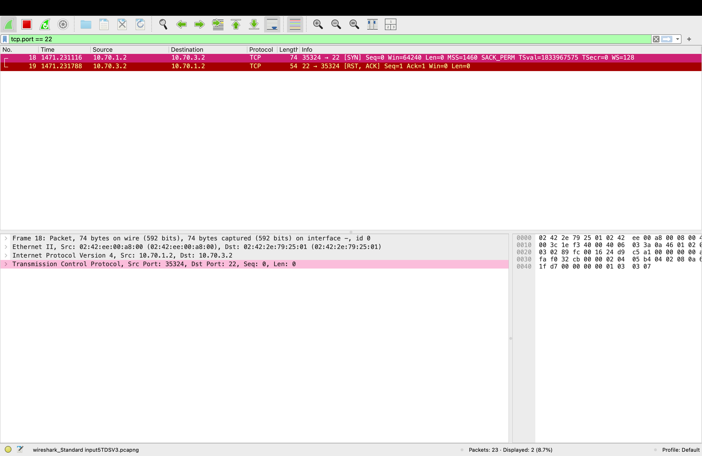
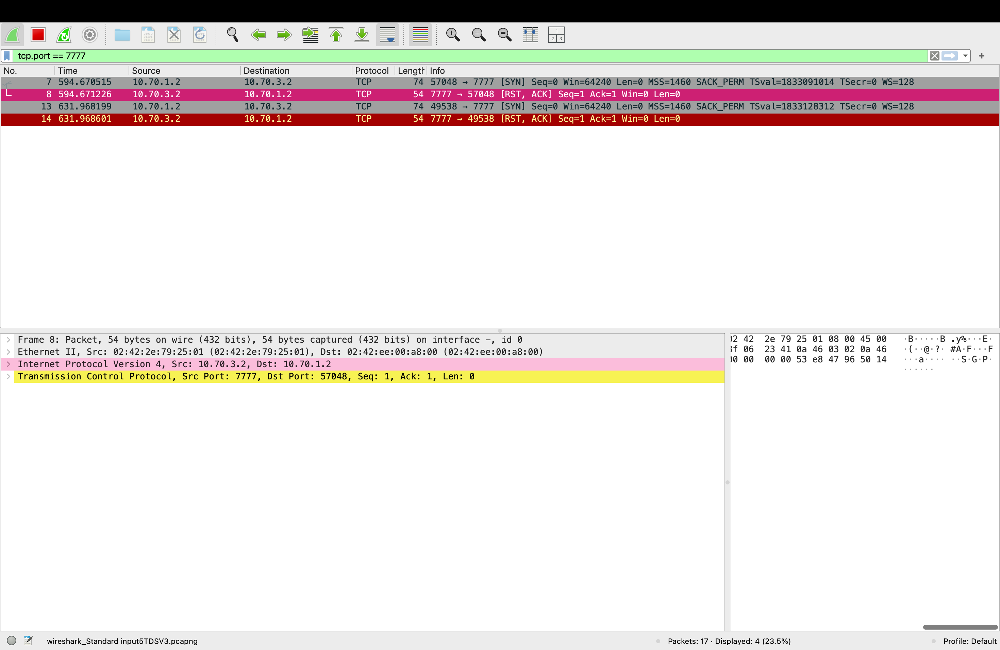
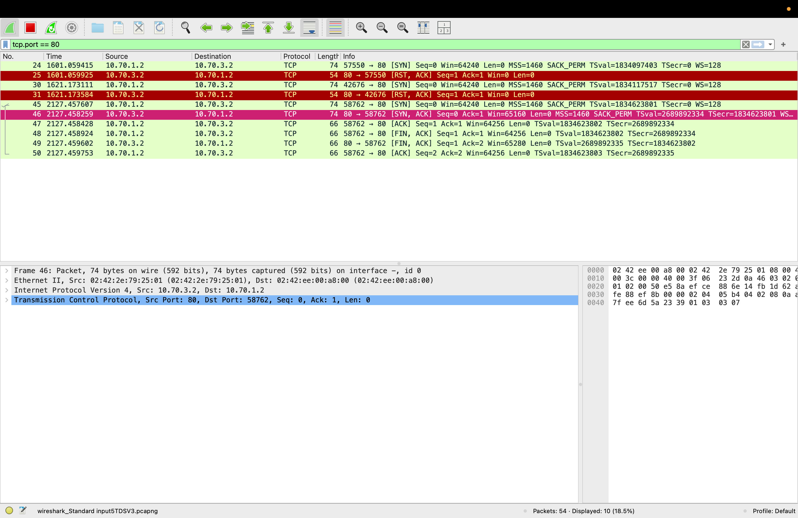


Rincian temuan:

- Port 22 dan 80 (terbuka): Alice mengirim `SYN`, Knights membalas `SYN, ACK` sebagai bagian dari three-way handshake normal.
- Port 7777 (tertutup): Alice mengirim `SYN`, Knights langsung membalas `RST, ACK` karena tidak ada service yang listen di port tersebut, sehingga handshake tidak pernah selesai.


## Soal 13

> Lain memerintahkan agar administrasi jarak jauh menggunakan SSH secara aman tanpa password. Install OpenSSH server pada node Knights, buat pasangan kunci SSH (ssh-keygen) pada node Mika untuk user mika_admin, dan konfigurasikan public key authentication (PasswordAuthentication no). Lakukan koneksi SSH dari node Mika ke node Knights, tangkap sesi menggunakan Wireshark, identifikasi paket Protocol Version Exchange dan Key Exchange, serta jelaskan mengapa kredensial tidak terlihat dalam bentuk teks terbuka seperti pada Telnet.

---

### Konfigurasi

OpenSSH server diinstal pada node Knights, dengan akun `mika_admin` dibuat di kedua sisi: sebagai user lokal di Mika tempat key pair dibuat, dan sebagai user tujuan login di Knights tempat public key ditaruh.

Instalasi dan penyiapan akun di Knights (server):
```bash
# debinet
apt-get install -y openssh-server
adduser mika_admin

# alpinet
apk add openssh
adduser -D mika_admin
service sshd start
```

Pembuatan key pair di Mika (client) untuk user `mika_admin`:
```bash
adduser -D mika_admin
su mika_admin
ssh-keygen -t rsa -b 4096 -f ~/.ssh/id_rsa -N ""
```

Menyalin public key ke Knights:
```bash
ssh-copy-id mika_admin@<10.4.89.246>
# alternatif manual kalau ssh-copy-id tidak tersedia di image minimal
cat ~/.ssh/id_rsa.pub | ssh mika_admin@<IP_Knights> "mkdir -p ~/.ssh && cat >> ~/.ssh/authorized_keys"
```

Konfigurasi `/etc/ssh/sshd_config` di Knights untuk mewajibkan public key authentication:
```
PubkeyAuthentication yes
PasswordAuthentication no
```

Restart service agar konfigurasi berlaku:
```bash
service sshd restart
```

### Verifikasi

Login dari Mika ke Knights menggunakan key tanpa diminta password:
```bash
ssh mika_admin@<10.4.89.246>
```

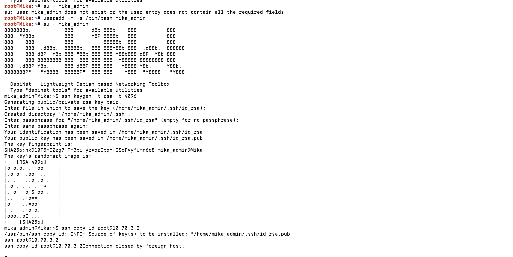

Capture Wireshark dengan filter `tcp.port==22` menunjukkan urutan awal sesi SSH:

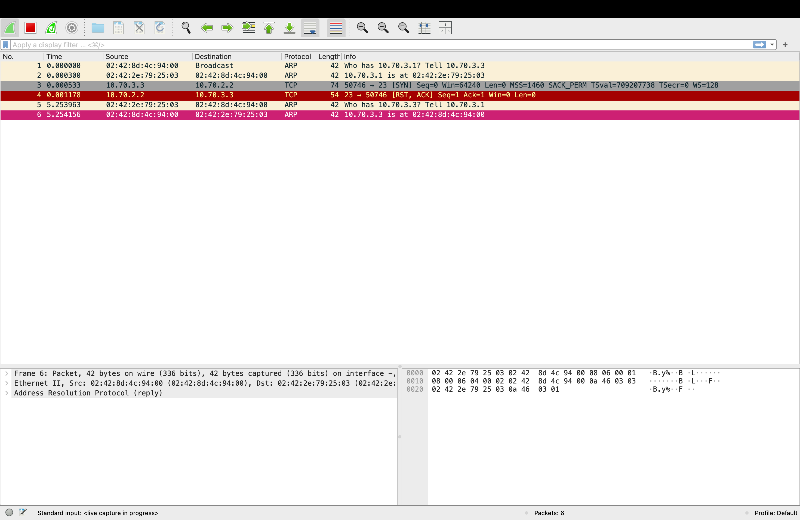

Rincian temuan:

- Protocol Version Exchange: masing-masing sisi mengirim banner plain text seperti `SSH-2.0-OpenSSH_9.x`, ini satu-satunya bagian sesi yang masih terbaca jelas karena baru pertukaran versi protokol, belum ada data sensitif.
- Key Exchange Init (`SSH_MSG_KEXINIT`): kedua sisi menegosiasikan algoritma enkripsi, key exchange, dan MAC yang akan dipakai, diikuti pertukaran Diffie-Hellman untuk membentuk shared secret.
- Setelah paket `New Keys` dikirim kedua arah, seluruh komunikasi berikutnya termasuk proses autentikasi public key dienkripsi menggunakan session key hasil key exchange.

Kredensial tidak terlihat dalam bentuk plain text seperti Telnet karena proses autentikasi (baik challenge-response public key maupun kalau pakai password) terjadi setelah symmetric session key terbentuk dari key exchange, sehingga seluruh payload autentikasi sudah terenkripsi sebelum dikirim lewat jaringan. Telnet tidak punya tahap key exchange sama sekali, sehingga setiap karakter termasuk kredensial dikirim apa adanya tanpa lapisan enkripsi.


## Soal 14

> Setelah gagal mengakses FTP, Eiri melancarkan serangan brute-force terhadap form login web Alice. Analisis file capture wired_bruteforce.pcapng untuk mengidentifikasi alamat IP penyerang, target IP beserta port yang diserang, password user lain_admin yang berhasil ditembus, serta web server software dan versi yang dilaporkan pada response header.

---

### Analisis

Kita buka file pcap-nya memakai WireShark lalu langsung filter dengan "http"

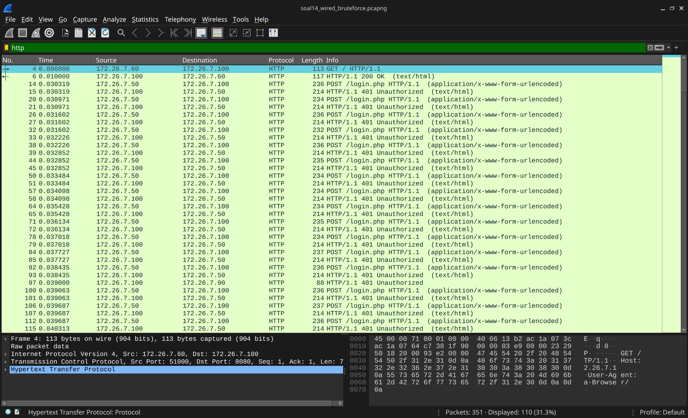

Kita langsung cari request POST yang menghasilkan response 200 OK dengan cara meng-scroll ke paling bawah.

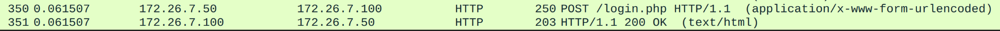

Kita buka packet request POST nya tadi, dan kita bisa mendapatkan username dan passwordnya. Di satu packet ini, kita juga bisa mendapatkan IP penyerang, IP target, dan portnya.

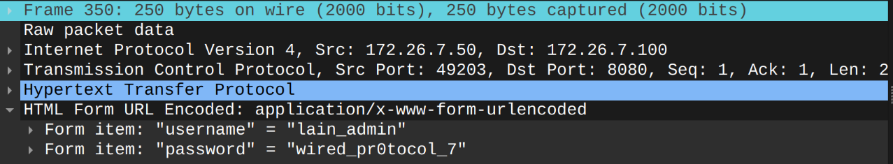

Dan di packet response dari POST request tadi, kita bisa mendapatkan webserver software dan versi yang digunakan.

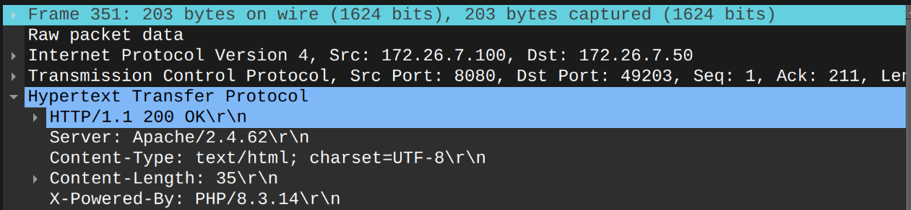

### Hasil yang didapatkan

- IP Penyerang : 172.26.7.50
- IP yang diserang : 172.26.7.100
- Port yang diserang : 8080
- Username : lain_admin
- Password : wired_pr0tocol_7
- Webserver software dan versi : Apache 2.4.62
- Flag : KOMJAR26{W1r3d_Brut3_FQTsG25AhaGkqnrr4oXOG1ejr}

## Soal 15

> Eiri menyusup ke ruang server dan memasang perangkat keyboard USB berbahaya pada node Alice. Buka file capture wired_usb_hid.pcap, identifikasi Vendor ID dan Product ID perangkat USB dari deskriptor USB, alamat nomor device USB, serta pesan rahasia yang berhasil dicuri dari keystroke.

---

### Analisis

File capture berisi trafik USB (bukan Ethernet). Device descriptor pada frame awal berisi field idVendor dan idProduct:

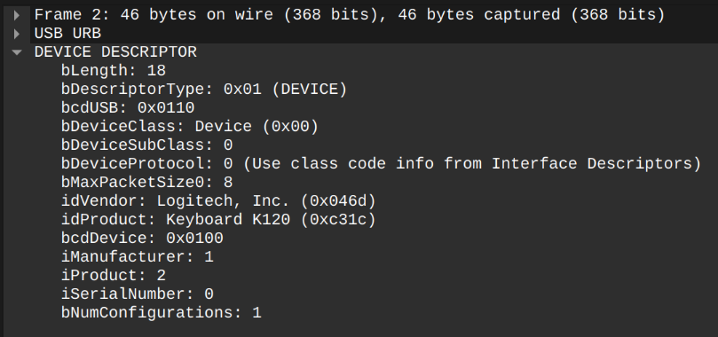

- Vendor ID: 0x046d (Logitech)
- Product ID: 0xc31c

Alamat device USB terlihat pada kolom source paket data HID: `2.7.1` berarti bus 2, device address 7, endpoint 1. Semua 60 paket keystroke berasal dari device address 7.

Pesan rahasia didekode dari paket HID Input Report (usb.capdata): setiap paket "USB INTERRUPT in" berisi 8 byte dengan byte ke-3 adalah keycode HID. Mengonversi keycode ke karakter (tabel HID Usage Keyboard, memperhitungkan modifier Shift padabyte pertama) menghasilkan pesan `Wired_Protocol_7_is_alive_2026`

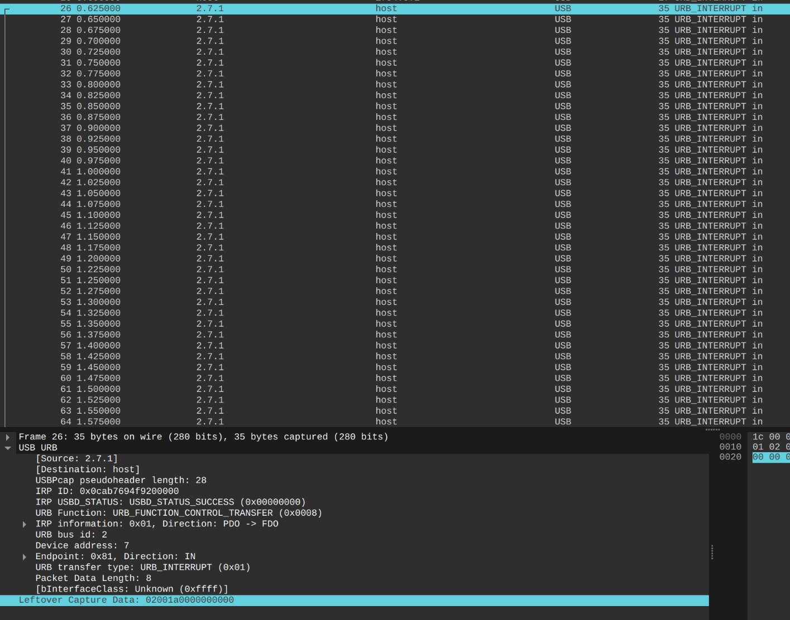
```
frame 26: 02 00 1a 00 00 00 00 00
          │  │  │
          │  │  └─ keycode 0x1a = 'w' key
          │  └──── reserved (selalu 00)
          └─────── modifier = 0x02 = Left Shift
```

### Hasil yang didapatkan

- Vendor ID: 0x046d (Logitech)
- Product ID: 0xc31c
- Pesan rahasia : `Wired_Protocol_7_is_alive_2026`
- Flag : KOMJAR26{USB_K3ystr0k3_tB8aNg7YhlAEqo61xn3CpihSQ}

## Soal 16

> Eiri meletakkan file malware di server. Dari file capture wired_ftp_theft.pcap, lakukan analisis lalu lintas FTP untuk mengidentifikasi alamat IP server FTP penyerang, banner software FTP yang digunakan, kredensial login penyerang, serta ukuran (size in bytes) dari file malware knights_payload.exe yang diunduh.

---

### Analisis

File capture memuat beberapa sesi FTP. Filter `ftp` memperlihatkan tiga server FTP berbeda; sesi yang melibatkan transfer malware diidentifikasi dari perintah "RETR knights_payload.exe", yaitu sesi antara 10.7.3.50 (client) dan 198.51.100.7 (server FTP penyerang).

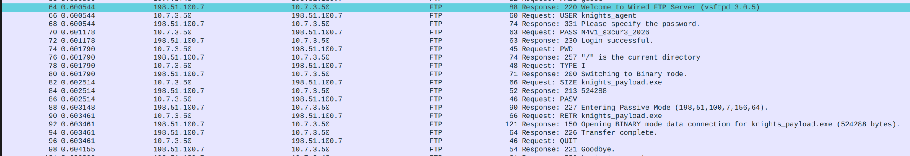

Dari traffic diatas, sudah keliatan semuanya bahwa:
- IP server FTP penyerang: 198.51.100.7
- Banner software FTP: "Welcome to Wired FTP Server (vsftpd 3.0.5)" - vsftpd 3.0.5
- Kredensial login penyerang: knights_agent / N4v1_s3cur3_2026
- Ukuran file malware knights_payload.exe: 524288 bytes

### Hasil yang didapatkan

- IP server FTP penyerang: 198.51.100.7
- software FTP: "vsftpd 3.0.5"
- Kredensial login penyerang: knights_agent:N4v1_s3cur3_2026
- Ukuran file malware knights_payload.exe: 524288
- Flag : KOMJAR26{FTP_Th3ft_7URCBhOeqDltM5Bg3e25pfmLB}

## Soal 17

> Alice membuat halaman web di node-nya. Eiri memanfaatkan celah untuk mengunduh payload berbahaya ke sistem Alice. Analisis file capture wired_http_c2.pcap untuk mengidentifikasi nama domain (Host) tempat malware diunduh, alamat IP server penyerang, nama file executable malware yang diunduh, serta kode status HTTP yang dikembalikan.

---

### Analisis

File capture memuat beberapa sesi HTTP dari dua host berbeda. Filter `http.request` memperlihatkan tiga request: GET style.css ke cdnstore.io, GET / ke protocol7.co.jp, dan satu request pengunduhan file executable:

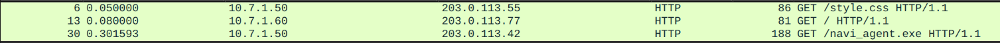

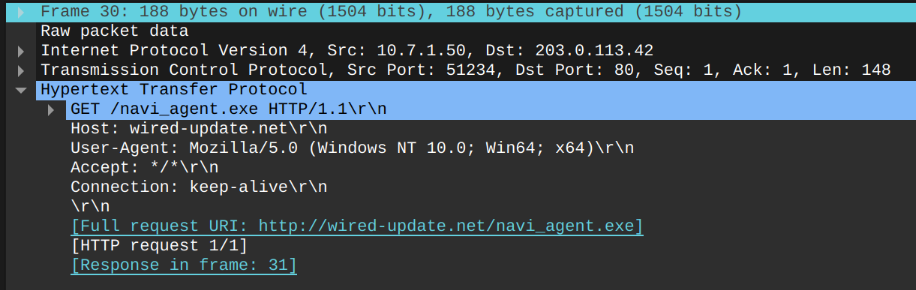

Sebelum request tersebut, terdapat query DNS untuk wired-update.net yang terjawab dengan alamat 203.0.113.42 - berarti domain malware tersebut di-resolve ke IP server penyerang. Respons dari server:

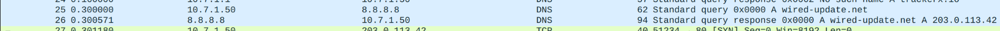

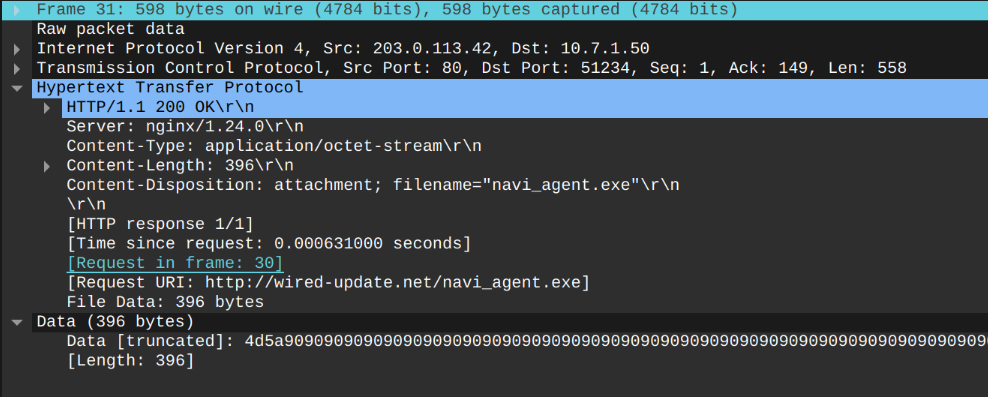

Payload respons diawali byte `4d 5a` ("MZ") — signature header file executable Windows (PE), mengonfirmasi bahwa file yang diunduh memang executable.

### Hasil yang didapatkan

- Domain (Host) tempat malware diunduh: wired-update.net
- IP server penyerang: 203.0.113.42
- Nama file executable malware: navi_agent.exe
- Kode status HTTP: 200 (OK)
- Flag : KOMJAR26{Navi_C2_D0wnl04d_Wc0u3xBFzqbnuTbeoN2T1KpMr}

## Soal 18

> Eiri mengubah taktik penyerangan dengan menanamkan file malware menggunakan protokol file sharing SMB. Analisis file capture wired_smb_transfer.pcapng untuk mengidentifikasi nama protokol jaringan yang dieksploitasi, IP pengirim dan penerima, folder tujuan penyimpanan malware pada sistem korban, serta nama file executable malware yang ditransfer.

---

### Analisis

File capture memuat satu sesi TCP ke port 445 milik 10.7.1.50 — port dan layanan Server Message Block (SMB2). Alur sesinya:

1. Negotiate Protocol Request/Response
2. Session Setup Request/Response
3. Tree Connect Request  Tree: \\10.7.1.50\ADMIN$
4. Create Request  File: System32\wired_trojan_payload.exe
5. Write Request    Len:1028 Off:0 File: System32\wired_trojan_payload.exe
6. Close Request/Response

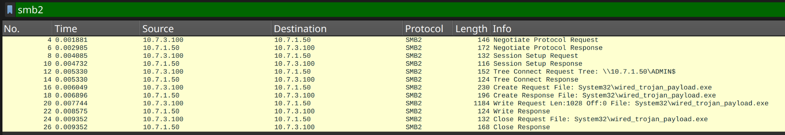

Penyerang (10.7.3.100) melakukan autentikasi lalu terhubung ke share administratif ADMIN$ milik korban (10.7.1.50). Share ADMIN$ dipetakan ke direktori C:\Windows, sehingga file malware ditulis langsung ke folder tersebut pada sistem korban. Pola seperti ini (menulis executable ke System32 lewat ADMIN$) adalah ciri khas teknik lateral movement ala PsExec.

### Hasil yang didapatkan

- Protokol yang dieksploitasi: smb2
- IP pengirim: 10.7.3.100
- IP penerima: 10.7.1.50
- Folder tujuan pada sistem korban: System32
- Nama file malware: wired_trojan_payload.exe
- Flag : KOMJAR26{SMB_Tr4nsf3r_pK35VHFyu7H2OTYZBKPrcKtAD}

## Soal 19

> Eiri meneror jaringan dengan mengirimkan email pemerasan melalui protokol SMTP tanpa enkripsi. Analisis file capture wired_smtp_threat.pcap pada stream TCP terkait, identifikasi alamat email korban yang ditargetkan, password korban yang diklaim bocor oleh penyerang, jenis malware yang diinfeksikan, batas waktu (dalam hari) yang diberikan, serta MailClientID yang tercantum pada pesan.

---

### Analisis

File capture memuat beberapa sesi SMTP pada port 25. Sesi yang memuat email pemerasan diidentifikasi dari percakapan antara 185.234.72.19 (penyerang, domain darkwired.net) dan 203.0.113.100 (mail server mail.protocol7.co.jp) pada paket nomer 86. 

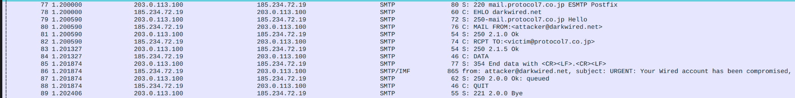

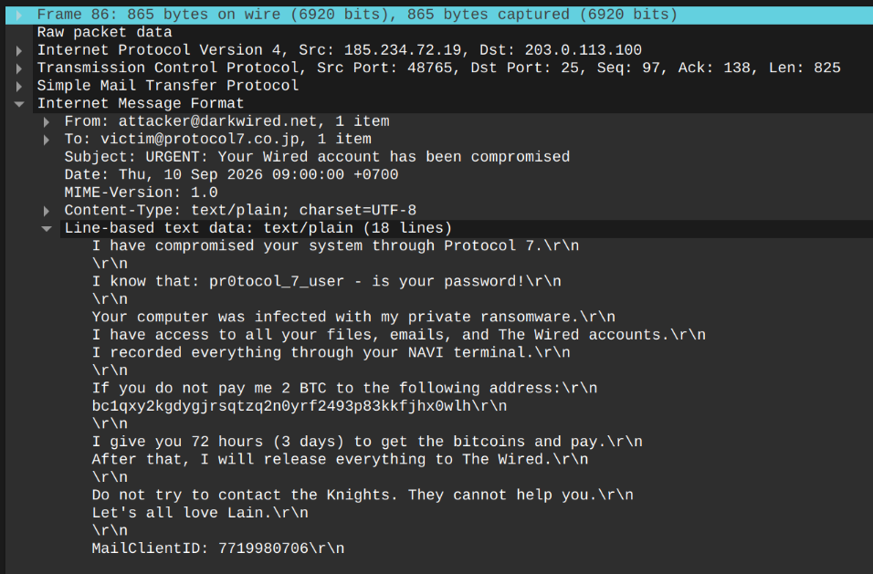


### Hasil yang didapatkan

- Alamat email korban: victim@protocol7.co.jp
- Password korban yang diklaim bocor: pr0tocol_7_user
- Jenis malware: ransomware 
- Batas waktu yang diberikan: 3 (hari)
- MailClientID: 7719980706
- Flag : KOMJAR26{SMTP_Ext0rt10n_1V3mzalfNgD9bn9g0uwWBCAKf}

## Soal 20

> Untuk rencana pamungkasnya, Eiri menyembunyikan komunikasi malware di balik saluran terenkripsi TLS. Namun Alice telah menyediakan file keylog untuk mendekripsi lalu lintas data tersebut. Analisis file capture wired_tls_decrypt.pcapng bersama keyslogfile.txt untuk mengidentifikasi versi protokol TLS yang dinegosiasikan, nama domain (SNI) yang diakses, alamat IP server HTTPS penyerang, User-Agent yang digunakan, serta HTTP request method dan path yang tersembunyi di dalam sesi dekripsi.

---

### Analisis

File capture memuat satu sesi TCP ke port 443 milik 93.184.216.34, seluruh payloadnya terenkripsi TLS sehingga tidak dapat dibaca langsung. Informasi yang tetap terlihat dibaca dari handshake TLS: paket ClientHello memuat Server Name Indication (SNI) `example.com` - nama domain yang diminta client (dikirim sebelum enkripsi aktif, sehingga tetap terlihat). ServerHello menjawab dengan version `0x0303` dan cipher suite `0xc02f` (TLS_ECDHE_RSA_WITH_AES_128_GCM_SHA256), versi TLS yang dinegosiasikan adalah TLS 1.2.

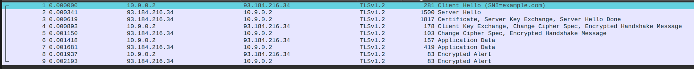

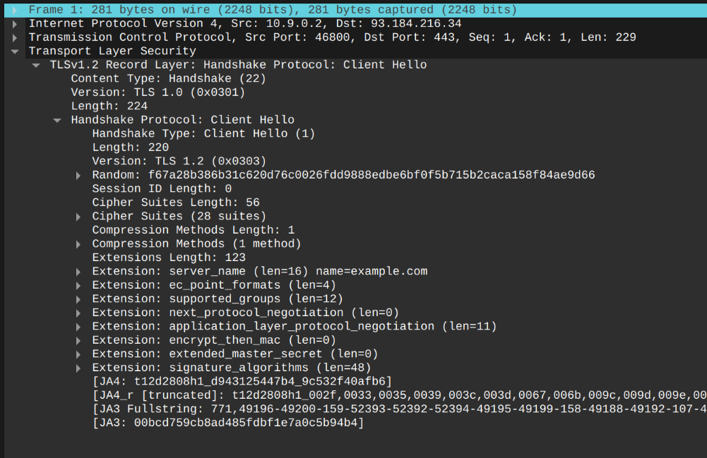

Isi sesi didekripsi dengan memuat keyslogfile.txt ke Wireshark (Edit -> Preferences -> Protocols -> TLS -> (Pre)-Master-Secret log filename). File tersebut berisi baris CLIENT_RANDOM yang menyimpan pre-master secret hasil SSLKEYLOGFILE, sehingga Wireshark dapat menurunkan kunci sesi dan membaca isi terenkripsinya. Setelah dekripsi, muncul packet HTTP di dalam trafficnya :

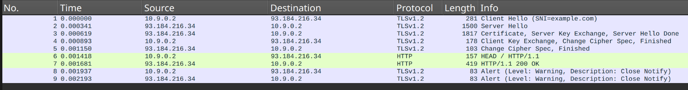

### Hasil yang didapatkan 

- Versi protokol TLS yang dinegosiasikan: TLSv1.2
- Nama domain (SNI) yang diakses: example.com
- Alamat IP server HTTPS: 93.184.216.34
- User-Agent yang digunakan: curl/7.62.0
- HTTP request method dan path tersembunyi: HEAD /
- Flag : KOMJAR26{TLS_D3crypt_GN2q1316UYbJ9Irwl4LgUzngQ}

---
### Konfigurasi

Interface eth0 pada router Lain dikonfigurasi untuk meminta alamat secara
dinamis (DHCP) dari node NAT GNS3, yang menyediakan jembatan ke jaringan
 fisik host. DNS resolver 8.8.8.8 diatur agar Lain juga mampu melakukan
resolusi nama domain (`/etc/network/interfaces`):
```
auto eth0
iface eth0 inet dhcp
    up echo "nameserver 8.8.8.8" > /etc/resolv.conf
```
### Verifikasi

Setelah node dinyalakan, eth0 mendapatkan IP dari DHCP NAT dan router Lain
berhasil mencapai internet publik:


## Soal 3

> Setelah router Lain terhubung ke internet, pastikan seluruh Entitas (Client) di bawah Switch 1, Switch 2, dan Switch 3 dapat saling terhubung dan berkomunikasi satu sama lain melalui konfigurasi routing.

---

### Konfigurasi

Tidak diperlukan konfigurasi routing tambahan. Router Lain secara otomatis mengenal ketiga subnet LAN (10.70.1.0/24, 10.70.2.0/24, 10.70.3.0/24) sebagai directly-connected network pada eth1-eth3, sehingga kernel Linux langsung membuat entri routing untuk masing-masing subnet. Pada sisi client, default gateway sudah diarahkan ke IP Lain di subnet masing-masing (10.70.x.1) pada konfigurasi Soal 1, sehingga paket antar-subnet otomatis diteruskan Lain:


### Verifikasi

Kami membuat script otomatis (dengan bantuan AI) yang terhubung ke konsol
telnet setiap node melalui GNS3 API, lalu menjalankan `ping` dari setiap
client ke seluruh client lain dan mencatat hasilnya sebagai matriks
konektivitas. Script tersebut juga otomatis menunggu hingga setiap node
selesai booting (interface eth0 sudah memiliki IP) sebelum pengujian
dimulai, sehingga hasilnya konsisten. Kode lengkap ada pada
`assets/soal3-verify_routing.py`.

Hasilnya, seluruh 20 kombinasi pengujian antar-client (termasuk semua
pasangan lintas subnet) berhasil:


## Soal 4

> Lain ingin agar setiap Entitas (Client) memiliki kemandirian di The Wired. Konfigurasikan firewall/iptables (NAT Masquerade) dan DNS resolver agar setiap Client dapat terhubung ke internet secara mandiri (dapat melakukan ping ke 8.8.8.8 dan membuka domain web google.com).

---

### Konfigurasi

Agar paket dari jaringan internal (10.70.x.x) dapat mencapai internet, router Lain perlu mengaktifkan IP forwarding dan menyamarkan (masquerade) alamat sumber paket menjadi IP publik eth0. Rule tersebut ditambahkan pada blok eth0 di `/etc/network/interfaces` dengan baris `up` agar otomatis aktif setiap node dinyalakan:
```
auto eth0
iface eth0 inet dhcp
    up echo "nameserver 8.8.8.8" > /etc/resolv.conf
    up sysctl -w net.ipv4.ip_forward=1
    up iptables -t nat -A POSTROUTING -o eth0 -j MASQUERADE
    up iptables -A FORWARD -i eth1 -o eth0 -j ACCEPT
    up iptables -A FORWARD -i eth2 -o eth0 -j ACCEPT
    up iptables -A FORWARD -i eth3 -o eth0 -j ACCEPT
    up iptables -A FORWARD -i eth0 -m state --state ESTABLISHED,RELATED -j ACCEPT
```

Penjelasan tiap rule:
- `sysctl -w net.ipv4.ip_forward=1` - mengizinkan kernel meneruskan paket antar-interface (tanpa ini paket dari LAN tidak akan pernah keluar lewat eth0).
- `iptables -t nat -A POSTROUTING -o eth0 -j MASQUERADE` - NAT masquerade: source IP private (10.70.x.x) diganti menjadi IP DHCP eth0 saat paket keluar ke internet, sehingga balasan dari internet tahu harus kembali ke Lain.
- `iptables -A FORWARD -i eth1..3 -o eth0 -j ACCEPT` - mengizinkan trafik dari ketiga LAN keluar ke WAN.
- `iptables -A FORWARD -i eth0 -m state --state ESTABLISHED,RELATED -j ACCEPT` - mengizinkan paket balasan dari internet masuk kembali ke LAN (hanya untuk koneksi yang sudah dibangun dari dalam).

DNS resolver sudah dikonfigurasi pada tiap client sejak Soal 1 (`nameserver 8.8.8.8` di `/etc/resolv.conf`), sehingga client juga mampu melakukan resolusi nama domain.

### Verifikasi

Dari console client, dilakukan pengujian `ping` ke IP DNS publik (8.8.8.8) dan ke nama domain (google.com). Berikut hasil dari node Alice (10.70.1.2, SW1):


Dan dari node Eiri (10.70.3.3, SW3) untuk mewakili subnet berbeda:


## Soal 5

> Eiri tetap berupaya menanamkan kekacauan ke dalam jaringan. Untuk mengantisipasi restart tiba-tiba, pastikan seluruh konfigurasi jaringan tidak hilang saat semua node di-restart. Buat script verifikasi di /root/cek_status.sh pada router Lain yang menampilkan ringkasan interface (ip -br a) dan status tabel NAT (iptables -t nat -L -v -n) setelah reboot.

---

### Konfigurasi

Karena node GNS3 berbasis container Docker yang bersifat ephemeral, konfigurasi jaringan harus dipasang agar otomatis aktif kembali setiap node dinyalakan. Seluruh konfigurasi jaringan (IP statis, gateway, DNS resolver, ip_forward, dan rule NAT MASQUERADE) sudah ditulis pada `/etc/network/interfaces` dengan baris `up` (Soal 1–4), sehingga dieksekusi ulang secara otomatis oleh `ifupdown` setiap boot. Hanya direktori `/root` yang persisten pada container, sehingga script verifikasi diletakkan di `/root/cek_status.sh`:

```
#!/bin/sh
echo "=== Ringkasan Interface (ip -br a) ==="
ip -br a
echo ""
echo "=== Status Tabel NAT (iptables -t nat -L -v -n) ==="
iptables -t nat -L -v -n
```

Script dibuat executable dengan `chmod +x /root/cek_status.sh`.

### Verifikasi

Sebagai simulasi restart tiba-tiba, seluruh node dihentikan kemudian
dinyalakan kembali. Setelah semua node up, `cek_status.sh` dijalankan pada
router Lain dan hasilnya menunjukkan seluruh konfigurasi tetap bertahan:

- Seluruh interface LAN tetap terpasang: eth1 `10.70.1.1`, eth2 `10.70.2.1`,
  eth3 `10.70.3.1`, dan eth0 kembali mendapat IP DHCP dari NAT.
- Rule `MASQUERADE` dan `FORWARD` pada tabel iptables tetap aktif (diterapkan
  ulang oleh baris `up` saat boot).

Sebelum reboot:


Setelah reboot:


## Soal 14

> Setelah gagal mengakses FTP, Eiri melancarkan serangan brute-force terhadap form login web Alice. Analisis file capture wired_bruteforce.pcapng untuk mengidentifikasi alamat IP penyerang, target IP beserta port yang diserang, password user lain_admin yang berhasil ditembus, serta web server software dan versi yang dilaporkan pada response header.

---

### Analisis

Kita buka file pcap-nya memakai WireShark lalu langsung filter dengan "http"


Kita langsung cari request POST yang menghasilkan response 200 OK dengan cara meng-scroll ke paling bawah.


Kita buka packet request POST nya tadi, dan kita bisa mendapatkan username dan passwordnya. Di satu packet ini, kita juga bisa mendapatkan IP penyerang, IP target, dan portnya.


Dan di packet response dari POST request tadi, kita bisa mendapatkan webserver software dan versi yang digunakan.


### Hasil yang didapatkan

- IP Penyerang : 172.26.7.50
- IP yang diserang : 172.26.7.100
- Port yang diserang : 8080
- Username : lain_admin
- Password : wired_pr0tocol_7
- Webserver software dan versi : Apache 2.4.62
- Flag : KOMJAR26{W1r3d_Brut3_FQTsG25AhaGkqnrr4oXOG1ejr}

## Soal 15

> Eiri menyusup ke ruang server dan memasang perangkat keyboard USB berbahaya pada node Alice. Buka file capture wired_usb_hid.pcap, identifikasi Vendor ID dan Product ID perangkat USB dari deskriptor USB, alamat nomor device USB, serta pesan rahasia yang berhasil dicuri dari keystroke.

---

### Analisis

File capture berisi trafik USB (bukan Ethernet). Device descriptor pada frame awal berisi field idVendor dan idProduct:


- Vendor ID: 0x046d (Logitech)
- Product ID: 0xc31c

Alamat device USB terlihat pada kolom source paket data HID: `2.7.1` berarti bus 2, device address 7, endpoint 1. Semua 60 paket keystroke berasal dari device address 7.

Pesan rahasia didekode dari paket HID Input Report (usb.capdata): setiap paket "USB INTERRUPT in" berisi 8 byte dengan byte ke-3 adalah keycode HID. Mengonversi keycode ke karakter (tabel HID Usage Keyboard, memperhitungkan modifier Shift padabyte pertama) menghasilkan pesan `Wired_Protocol_7_is_alive_2026`


```
frame 26: 02 00 1a 00 00 00 00 00
          │  │  │
          │  │  └─ keycode 0x1a = 'w' key
          │  └──── reserved (selalu 00)
          └─────── modifier = 0x02 = Left Shift
```

### Hasil yang didapatkan

- Vendor ID: 0x046d (Logitech)
- Product ID: 0xc31c
- Pesan rahasia : `Wired_Protocol_7_is_alive_2026`
- Flag : KOMJAR26{USB_K3ystr0k3_tB8aNg7YhlAEqo61xn3CpihSQ}

## Soal 16

> Eiri meletakkan file malware di server. Dari file capture wired_ftp_theft.pcap, lakukan analisis lalu lintas FTP untuk mengidentifikasi alamat IP server FTP penyerang, banner software FTP yang digunakan, kredensial login penyerang, serta ukuran (size in bytes) dari file malware knights_payload.exe yang diunduh.

---

### Analisis

File capture memuat beberapa sesi FTP. Filter `ftp` memperlihatkan tiga server FTP berbeda; sesi yang melibatkan transfer malware diidentifikasi dari perintah "RETR knights_payload.exe", yaitu sesi antara 10.7.3.50 (client) dan 198.51.100.7 (server FTP penyerang).


Dari traffic diatas, sudah keliatan semuanya bahwa:
- IP server FTP penyerang: 198.51.100.7
- Banner software FTP: "Welcome to Wired FTP Server (vsftpd 3.0.5)" - vsftpd 3.0.5
- Kredensial login penyerang: knights_agent / N4v1_s3cur3_2026
- Ukuran file malware knights_payload.exe: 524288 bytes

### Hasil yang didapatkan

- IP server FTP penyerang: 198.51.100.7
- software FTP: "vsftpd 3.0.5"
- Kredensial login penyerang: knights_agent:N4v1_s3cur3_2026
- Ukuran file malware knights_payload.exe: 524288
- Flag : KOMJAR26{FTP_Th3ft_7URCBhOeqDltM5Bg3e25pfmLB}

## Soal 17

> Alice membuat halaman web di node-nya. Eiri memanfaatkan celah untuk mengunduh payload berbahaya ke sistem Alice. Analisis file capture wired_http_c2.pcap untuk mengidentifikasi nama domain (Host) tempat malware diunduh, alamat IP server penyerang, nama file executable malware yang diunduh, serta kode status HTTP yang dikembalikan.

---

### Analisis

File capture memuat beberapa sesi HTTP dari dua host berbeda. Filter `http.request` memperlihatkan tiga request: GET style.css ke cdnstore.io, GET / ke protocol7.co.jp, dan satu request pengunduhan file executable:


Sebelum request tersebut, terdapat query DNS untuk wired-update.net yang terjawab dengan alamat 203.0.113.42 - berarti domain malware tersebut di-resolve ke IP server penyerang. Respons dari server:


Payload respons diawali byte `4d 5a` ("MZ") — signature header file executable Windows (PE), mengonfirmasi bahwa file yang diunduh memang executable.

### Hasil yang didapatkan

- Domain (Host) tempat malware diunduh: wired-update.net
- IP server penyerang: 203.0.113.42
- Nama file executable malware: navi_agent.exe
- Kode status HTTP: 200 (OK)
- Flag : KOMJAR26{Navi_C2_D0wnl04d_Wc0u3xBFzqbnuTbeoN2T1KpMr}

## Soal 18

> Eiri mengubah taktik penyerangan dengan menanamkan file malware menggunakan protokol file sharing SMB. Analisis file capture wired_smb_transfer.pcapng untuk mengidentifikasi nama protokol jaringan yang dieksploitasi, IP pengirim dan penerima, folder tujuan penyimpanan malware pada sistem korban, serta nama file executable malware yang ditransfer.

---

### Analisis

File capture memuat satu sesi TCP ke port 445 milik 10.7.1.50 — port dan layanan Server Message Block (SMB2). Alur sesinya:

1. Negotiate Protocol Request/Response
2. Session Setup Request/Response
3. Tree Connect Request  Tree: \\10.7.1.50\ADMIN$
4. Create Request  File: System32\wired_trojan_payload.exe
5. Write Request    Len:1028 Off:0 File: System32\wired_trojan_payload.exe
6. Close Request/Response


Penyerang (10.7.3.100) melakukan autentikasi lalu terhubung ke share administratif ADMIN$ milik korban (10.7.1.50). Share ADMIN$ dipetakan ke direktori C:\Windows, sehingga file malware ditulis langsung ke folder tersebut pada sistem korban. Pola seperti ini (menulis executable ke System32 lewat ADMIN$) adalah ciri khas teknik lateral movement ala PsExec.

### Hasil yang didapatkan

- Protokol yang dieksploitasi: smb2
- IP pengirim: 10.7.3.100
- IP penerima: 10.7.1.50
- Folder tujuan pada sistem korban: System32
- Nama file malware: wired_trojan_payload.exe
- Flag : KOMJAR26{SMB_Tr4nsf3r_pK35VHFyu7H2OTYZBKPrcKtAD}

## Soal 19

> Eiri meneror jaringan dengan mengirimkan email pemerasan melalui protokol SMTP tanpa enkripsi. Analisis file capture wired_smtp_threat.pcap pada stream TCP terkait, identifikasi alamat email korban yang ditargetkan, password korban yang diklaim bocor oleh penyerang, jenis malware yang diinfeksikan, batas waktu (dalam hari) yang diberikan, serta MailClientID yang tercantum pada pesan.

---

### Analisis

File capture memuat beberapa sesi SMTP pada port 25. Sesi yang memuat email pemerasan diidentifikasi dari percakapan antara 185.234.72.19 (penyerang, domain darkwired.net) dan 203.0.113.100 (mail server mail.protocol7.co.jp) pada paket nomer 86. 


### Hasil yang didapatkan

- Alamat email korban: victim@protocol7.co.jp
- Password korban yang diklaim bocor: pr0tocol_7_user
- Jenis malware: ransomware 
- Batas waktu yang diberikan: 3 (hari)
- MailClientID: 7719980706
- Flag : KOMJAR26{SMTP_Ext0rt10n_1V3mzalfNgD9bn9g0uwWBCAKf}

## Soal 20

> Untuk rencana pamungkasnya, Eiri menyembunyikan komunikasi malware di balik saluran terenkripsi TLS. Namun Alice telah menyediakan file keylog untuk mendekripsi lalu lintas data tersebut. Analisis file capture wired_tls_decrypt.pcapng bersama keyslogfile.txt untuk mengidentifikasi versi protokol TLS yang dinegosiasikan, nama domain (SNI) yang diakses, alamat IP server HTTPS penyerang, User-Agent yang digunakan, serta HTTP request method dan path yang tersembunyi di dalam sesi dekripsi.

---

### Analisis

File capture memuat satu sesi TCP ke port 443 milik 93.184.216.34, seluruh payloadnya terenkripsi TLS sehingga tidak dapat dibaca langsung. Informasi yang tetap terlihat dibaca dari handshake TLS: paket ClientHello memuat Server Name Indication (SNI) `example.com` - nama domain yang diminta client (dikirim sebelum enkripsi aktif, sehingga tetap terlihat). ServerHello menjawab dengan version `0x0303` dan cipher suite `0xc02f` (TLS_ECDHE_RSA_WITH_AES_128_GCM_SHA256), versi TLS yang dinegosiasikan adalah TLS 1.2.


Isi sesi didekripsi dengan memuat keyslogfile.txt ke Wireshark (Edit -> Preferences -> Protocols -> TLS -> (Pre)-Master-Secret log filename). File tersebut berisi baris CLIENT_RANDOM yang menyimpan pre-master secret hasil SSLKEYLOGFILE, sehingga Wireshark dapat menurunkan kunci sesi dan membaca isi terenkripsinya. Setelah dekripsi, muncul packet HTTP di dalam trafficnya :


### Hasil yang didapatkan 

- Versi protokol TLS yang dinegosiasikan: TLSv1.2
- Nama domain (SNI) yang diakses: example.com
- Alamat IP server HTTPS: 93.184.216.34
- User-Agent yang digunakan: curl/7.62.0
- HTTP request method dan path tersembunyi: HEAD /
- Flag : KOMJAR26{TLS_D3crypt_GN2q1316UYbJ9Irwl4LgUzngQ}
